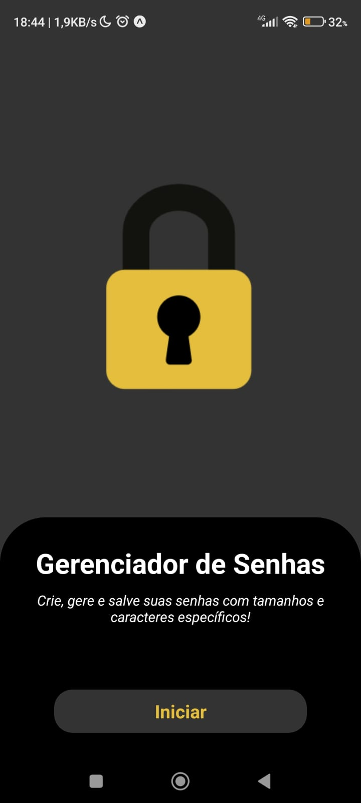
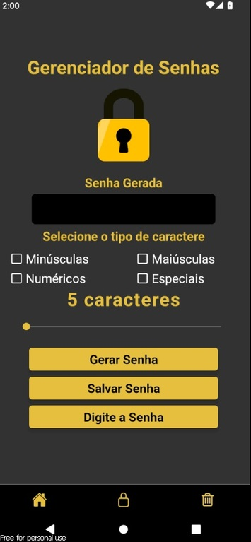
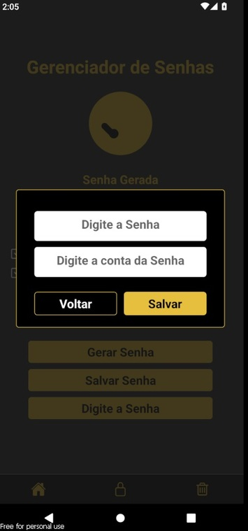
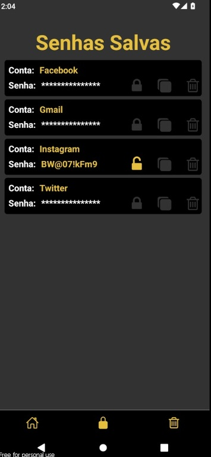
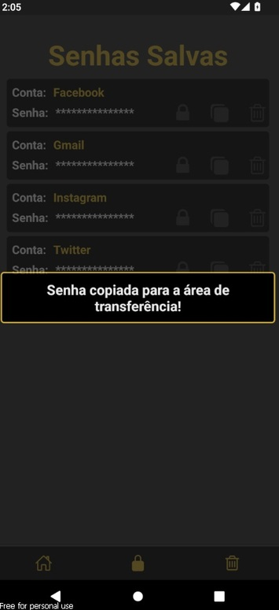
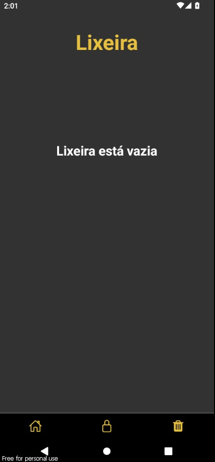

# 📱 Gerenciador de Senhas

Um aplicativo mobile para gerenciar suas senhas de um modo fácil e seguro.

## 🚀 Funcionalidades Principais

- **Criar senhas:**
  - Crie suas suas senhas de acordo com sua preferência de tamanho e caracteres especiais.
  - Caso queria salvar uma senha já existente, tem a opção de digitar a senha também.

- **Salvar senhas:**
  - Salve suas senhas onde elas ficam mascaradas até sua ordem. Também tem a opção de copiá-las.

- **Sem conexão:**
  - Este aplicativo não tem conexão com a internet.

- **Lixeira:**
  - Caso tenha apagado a senha sem querer, ela vai para uma LIXEIRA antes de ser completamente apagada.

## ⚙️ Tecnologias Utilizadas:
    - ⚛️ React Native;
    - ⚛️ Expo;
    - 🚀 TypeScript;

## Instalação

### Android

1. Faça o download do APK mais recente do [Aplicativo](https://github.com/Emerson2342/gerador-senha/releases/).
2. Instale o APK no seu dispositivo Android.
3. Sendo uma aplicação fora da play store, vai ser necessário permitir instalar aplicações de fontes não confiáveis.

### iOS

Atualmente não suportado.

## Como Usar

- **Configuração Inicial:**
  - Para gerar uma senha, defina o tamanho dela e selecione dentre as 4 opções o tipo de senha desejado.
  - Caso queira salvar uma senha já existente, pode ir na opção DIGITE A SENHA.

 | 
|:---:|:---:|

 | 
|:---:|:---:|

 | 
|:---:|:---:|

 | 
|:---:|:---:|

  ## Licença

-**Suporte**
    Para suporte ou feedback, entre em contato via WhatsApp: +55 (61) 99835-4398 (https://wa.me/5561998354398) ou pelo email: lyncoln_erc@hotmail.com

---
2024 | Desenvolvido por Emerson Ribeiro